# Camunda workshop
In deze workshop gaan we een hypotheekaanvraag proces modelleren en deployen in Camunda.
We gaan ook workers maken die voor ons stappen in het proces automatiseren.<br>
We gaan dit met deze Quarkus applicatie aan de praat zien te krijgen.

Deze quarkus applicatie bevat al een klein procesje (zie resources -> proces -> hypotheek-aanvraag.bpmn). Om deze te openen dien je de camunda modeler te downloaden: https://camunda.com/download/modeler/<br>
Ook deployed deze applicatie het proces (zie ProcessDeployManager.java)

## Stappen om het Camunda cluster te maken
Volg de onderstaande stappen om het Camunda cluster te maken. Als al deze stappen succesvol zijn voltooid, dan ben je klaar voor de workshop.

### Stap 1 Maak een camunda account
https://accounts.camunda.io/signup

### Stap 2 Maak een cluster
Nadat je bent ingelogd, ga naar de console, dan naar <b>Clusters</b> en klik op <b>Create new cluster</b>.<br>
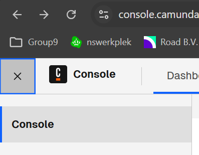
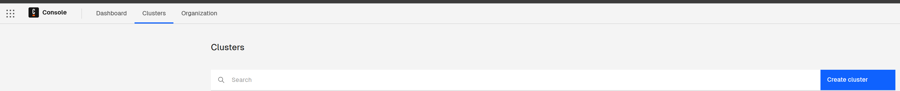
Geef bij Cluster name een naam op.<br>
Kies bij Select region: <b>GCP</b>, <b>London, Europe (europe-west2)</b><br>
Kies bij Channel: <b>Stable</b><br>
Klik op <b>Create cluster</b>.<br>
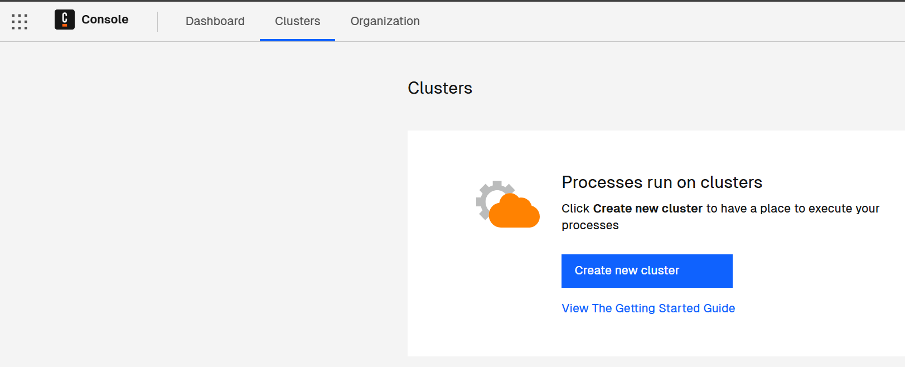<br>
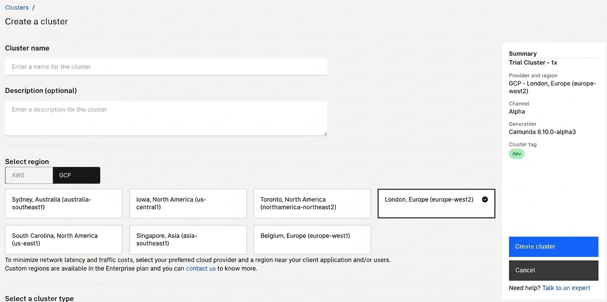<br>
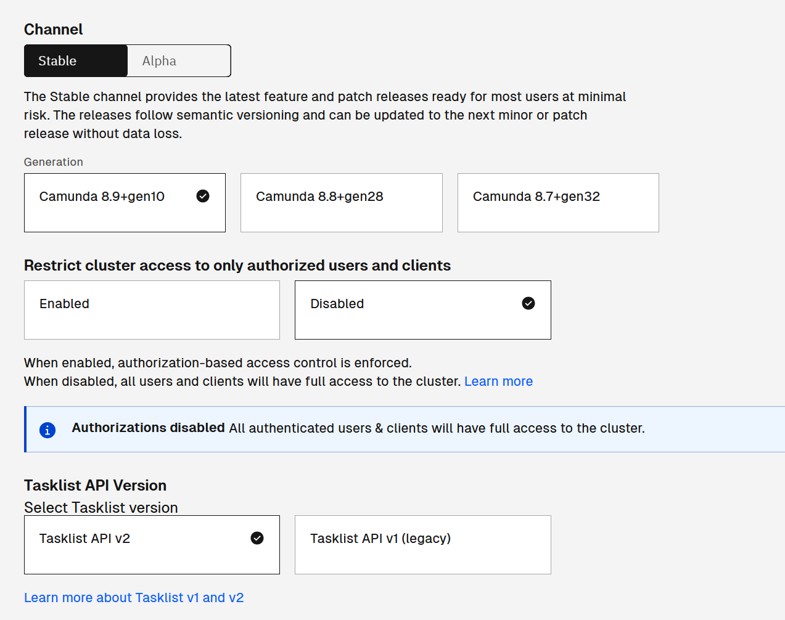<br>
Het cluster is nu gemaakt.<br>
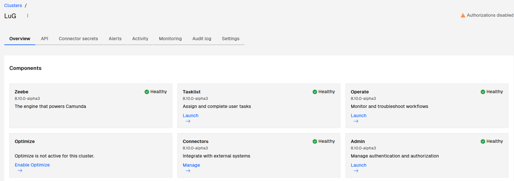

### Stap 3 Maak een client
Ga naar <b>API</b> en klik op <b>Create your first client</b>.<br>
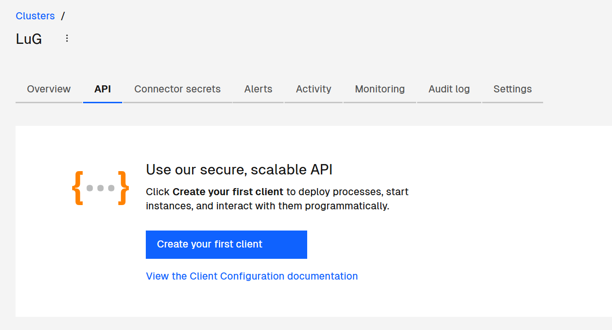
Geef bij Client Name een naam op.<br>
Bij scopes vink je het volgende aan:<br> 
<b>Orchestration Cluster API</b><br>
<b>Optimize API</b><br>
<b>Administration API</b><br>
Klik op <b>Create</b>.<br>
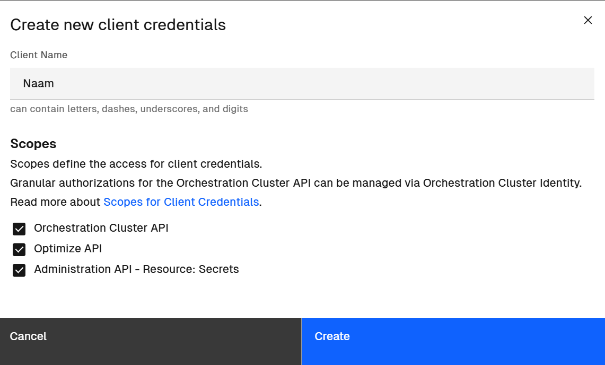<br>
Je krijgt nu een scherm met credentials. Deze heb je nodig in de application.properties.<br>
<b> LET OP:</b> Deze krijg je maar eenmalig te zien. Klik op <b>Download credentials</b> om ze te downloaden.<br>
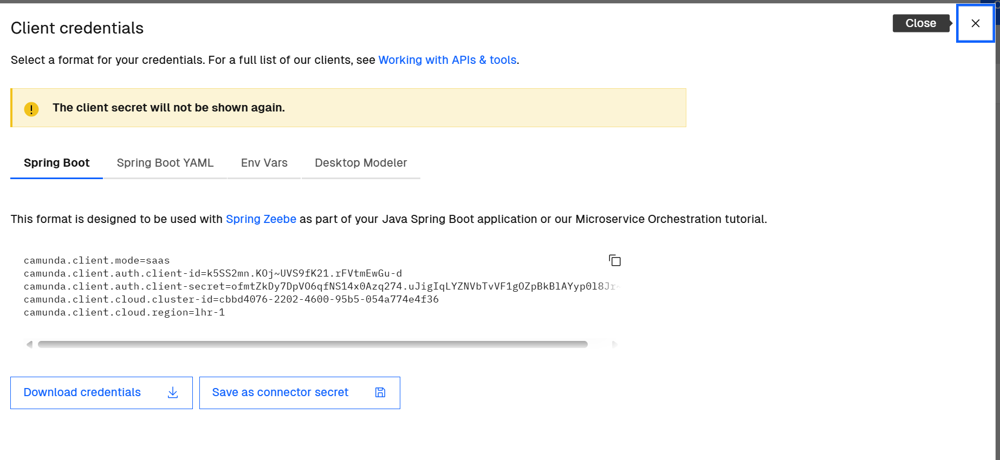<br>
Neem de waarden van de volgende properties over in de <b>application.properties</b>:<br>
camunda.client.auth.client-id -> quarkus.zeebe.client.cloud.client-id<br>
camunda.client.auth.client-secret -> quarkus.zeebe.client.cloud.client-secret<br>
camunda.client.cloud.cluster-id -> quarkus.zeebe.client.cloud.cluster-id<br>
camunda.client.cloud.region -> quarkus.zeebe.client.cloud.region<br>

### Stap 4 Start de applicatie
```
./mvnw quarkus:dev
```
Als het starten is gelukt, dan wordt het proces deployed in je cluster. Je zal deze logregels zien:<br>
====Hypotheekaanvraag proces deploy starten...====<br>
====Hypotheekaanvraag proces gedeployed====<br>
In Camunda kun je controleren of het proces is gedeployed.<br>
Ga naar Operate en dan naar Processes.<br>
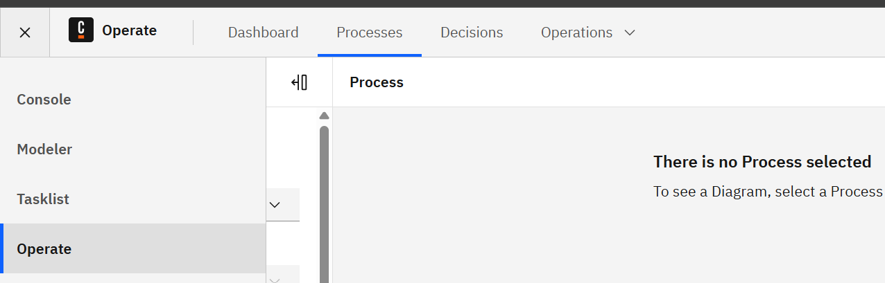<br>
Links bij Process kan je het proces selecteren.<br>
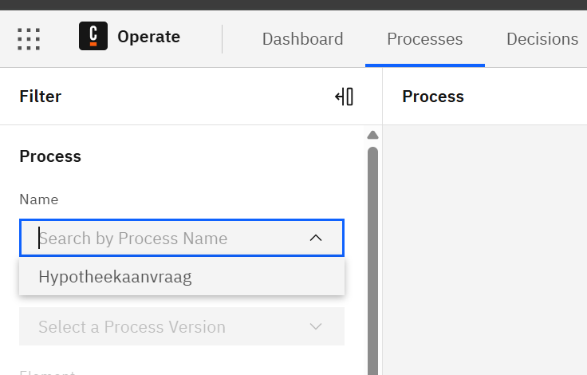<br>
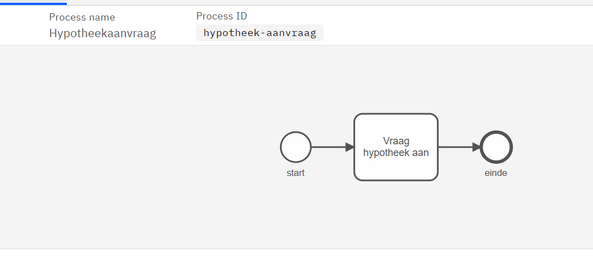<br>

### Hoezee het is gelukt! 😄😄🚀🚀💪💪